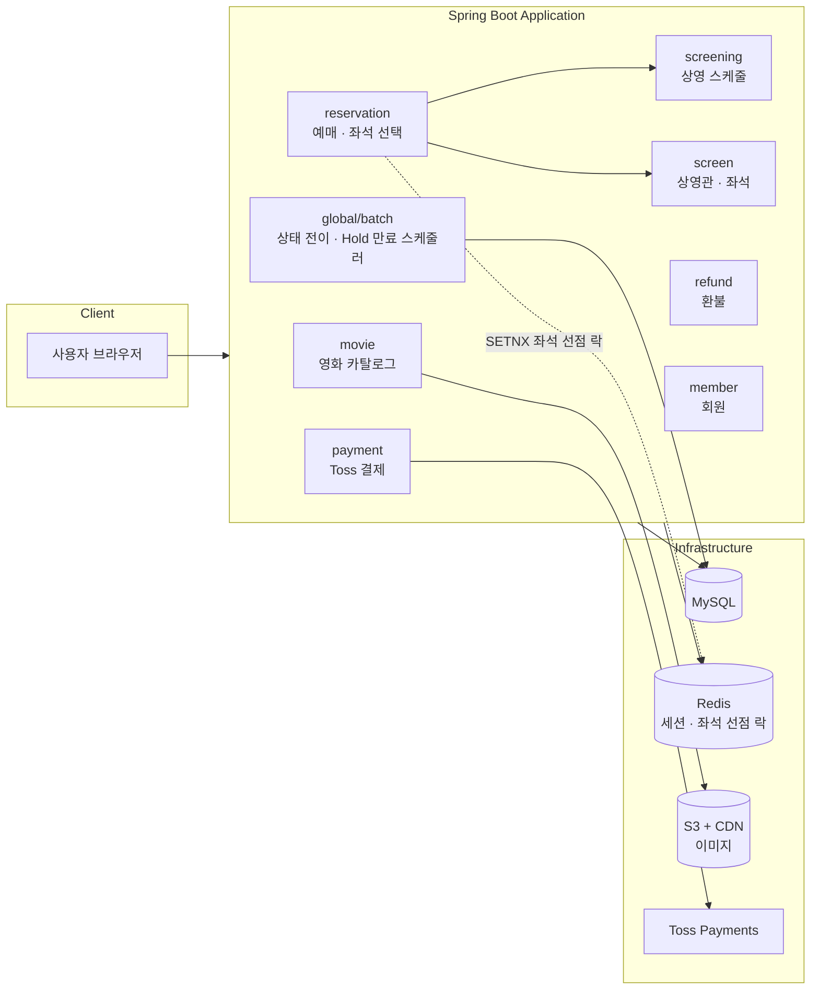

# 🎬 Movie Ticket Reservation

영화관 좌석 예매 시스템 — 상영 스케줄 조회부터 좌석 선점, 결제, 환불까지 예매 플로우 전체를 다루는 Spring Boot 기반 웹 애플리케이션입니다.

## 목차

- [주요 기능](#주요-기능)
- [기술 스택](#기술-스택)
- [아키텍처](#아키텍처)
- [실행 방법](#실행-방법)
- [테스트 계정](#테스트-계정)

## 주요 기능

**사용자**
- 회원가입 / 로그인 (세션 기반 폼 인증)
- 영화 목록/상세 조회, 리뷰 작성
- 상영 스케줄 조회 및 좌석 선택
- 좌석 선점(Hold) → 결제(Toss Payments) → 예매 확정
- 마이페이지에서 예매 내역 조회 및 취소/환불 신청

**관리자**
- 영화 등록/수정 (포스터 이미지 업로드)
- 상영관/좌석, 상영 스케줄 관리
- 예매/환불 현황 관리

**배치**
- 영화·상영 상태 자동 전이 (예정 → 상영중 → 종료)
- 만료된 좌석 선점(Hold) 자동 해제
- 예매율 통계 갱신

## 기술 스택

| 구분 | 스택 |
|---|---|
| Language / Runtime | Java 21 |
| Framework | Spring Boot 3.5 (Spring MVC, Spring Security, Spring Session) |
| View | Thymeleaf |
| Database | MySQL (dev), H2 (local/test), Flyway |
| Query | Spring Data JPA, QueryDSL |
| Cache / Lock | Redis (세션 스토리지, 좌석 선점 분산 락) |
| DTO 변환 | MapStruct |
| 파일 스토리지 | AWS S3 (CDN 연동), 로컬 스토리지 |
| 결제 | Toss Payments |
| 인프라 / 배포 | Docker, AWS ECS Fargate, GitHub Actions CI/CD |
| 부하 테스트 | k6 |

## 아키텍처

도메인 단위로 패키지를 구성하고(`domain/movie`, `domain/reservation` 등), 각 도메인은 controller/service/repository/entity/dto/mapper로 구성됩니다. 공통 설정과 배치 잡은 `global` 패키지에 모아둡니다.



**배포**: GitHub Actions가 `dev` 브랜치 push 시 테스트 → 빌드 → ECR 푸시 → ECS Fargate 롤링 배포를 수행합니다 (AWS OIDC 인증).

## 실행 방법

### 사전 준비
- Java 21
- Redis (`localhost:6379`) — local 프로필에서도 세션 스토리지/좌석 선점 락에 필요

### 로컬 구동 (H2 인메모리 DB)

```bash
git clone <repo-url>
cd movie-ticket-reservation

# Redis 실행 (Docker 사용 시)
docker run -d -p 6379:6379 redis

# 애플리케이션 실행
./gradlew bootRun
```

기본 프로필은 `local`이며, H2 인메모리 DB로 별도 DB 설치 없이 바로 구동됩니다.

### 배포 환경 (dev)

<!-- TODO: AWS 재기동 후 실제 접속 URL로 교체 -->
`https://<dev-서버-주소>` — AWS ECS Fargate 기반 dev 환경입니다. 비용 관리를 위해 상시 기동하지 않으며, 필요 시 재기동해 접속을 제공합니다.

### 테스트 실행

```bash
./gradlew test
```

## 테스트 계정

애플리케이션 최초 구동 시 아래 계정이 자동 생성됩니다.

| Email | Password | Role |
|---|---|---|
| `admin@test.com` | `1234` | ADMIN |
| `user@test.com` | `1234` | USER |
